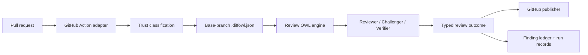

<div align="center">

# Diffowl

**Self-hostable, evidence-backed pull-request review for teams that still want humans making the call.**

[](https://github.com/D4NZ-jpg/diffowl/actions/workflows/ci.yml)


</div>

Diffowl runs an automated first pass over pull requests and turns the result into a typed, auditable review outcome. Its Review OWL engine separates material findings from advisory suggestions, records the evidence behind each finding, and keeps the final merge decision where it belongs: with a human reviewer.

> [!IMPORTANT]
> A `clean` Diffowl result means no material findings were found within completed permitted coverage. It is not a proof of correctness, a merge decision, or a replacement for product judgment.

## What Diffowl gives you

- **Self-hostable GitHub Action** — install it in a repository without depending on a hosted Diffowl service.
- **Reusable review engine** — one typed contract for GitHub Actions, local CLI runs, and future embeddings.
- **Trust-aware execution** — same-repository, fork, Dependabot, local, and publisher contexts receive different capabilities.
- **Base-branch policy** — `.diffowl.json` is read from the trusted base revision so a pull request cannot weaken its own rules.
- **Finding lifecycle** — findings have stable identities and can be accepted, rebutted, resolved, suppressed, ignored, rechecked, or reassessed.
- **Durable state without a database** — GitHub-hosted runs store review state in dedicated Git refs; explicit self-hosted runs can use a trusted filesystem directory.
- **BYOK model configuration** — reviewer, challenger, and verifier roles are configured by provider/model profile and backed by your own credentials.
- **Local reproduction** — run the same engine from the CLI for debugging, inspection, and synthetic evaluation.

## How it works



Diffowl keeps review semantics in the engine and GitHub-specific behavior in the Action adapter:

1. The Action verifies the pull-request context and checks out the exact head revision with full history.
2. Diffowl loads project policy from the base branch and classifies trust before risky work starts.
3. The engine orchestrates role-based review, verification, finding normalization, and outcome generation.
4. The publisher posts one non-approving PR review when actionable findings exist.
5. Durable state reconciles finding identity and lifecycle across pushes, reruns, and discussion commands.

## Quick start: GitHub Action

Create `.github/workflows/review-owl.yml`:

```yaml
name: Review OWL

on:
  pull_request:
    types: [opened, synchronize, reopened]
  workflow_dispatch:
    inputs:
      repository: { required: true, type: string }
      pull-request-number: { required: true, type: string }
      base-sha: { required: true, type: string }
      head-sha: { required: true, type: string }
      review-request-event-id: { required: true, type: string }
      command-work-type: { required: false, type: string }
      finding-fingerprint: { required: false, type: string }
      finding-context: { required: false, type: string }
      finding-root-comment-id: { required: false, type: string }

concurrency:
  group: review-owl-${{ inputs.pull-request-number || github.event.pull_request.number }}
  cancel-in-progress: true

permissions:
  contents: write
  pull-requests: write
  issues: read

jobs:
  review:
    runs-on: ubuntu-latest
    steps:
      - uses: actions/checkout@v4
        with:
          ref: ${{ inputs.head-sha || github.event.pull_request.head.sha }}
          fetch-depth: 0
          persist-credentials: false
      - id: review-owl
        uses: D4NZ-jpg/diffowl@main
        with:
          repository: ${{ inputs.repository }}
          pull-request-number: ${{ inputs.pull-request-number }}
          base-sha: ${{ inputs.base-sha }}
          head-sha: ${{ inputs.head-sha }}
          review-request-event-id: ${{ inputs.review-request-event-id }}
          command-work-type: ${{ inputs.command-work-type }}
          finding-fingerprint: ${{ inputs.finding-fingerprint }}
          finding-context: ${{ inputs.finding-context }}
          finding-root-comment-id: ${{ inputs.finding-root-comment-id }}
        env:
          GITHUB_TOKEN: ${{ github.token }}
          OPENAI_API_KEY: ${{ secrets.OPENAI_API_KEY }}
          ANTHROPIC_API_KEY: ${{ secrets.ANTHROPIC_API_KEY }}
```

> [!TIP]
> Copy the complete representative setup from [`examples/representative-repository`](examples/representative-repository). It includes the main review workflow, the trusted request router workflow, and a sample `.diffowl.json` policy.

To enable `/diffowl ...` review and finding commands, also install the trusted router workflow at [`examples/representative-repository/.github/workflows/review-request.yml`](examples/representative-repository/.github/workflows/review-request.yml). The router carries no provider secrets, checks out only the default branch, authenticates the actor, records a command event, and dispatches the canonical review workflow with verified inputs.

## Project policy

Diffowl reads `.diffowl.json` from the pull request's **base commit**. Unsupported active fields fail closed instead of being ignored.

```json
{
  "version": 1,
  "scope": {
    "includePaths": ["src/**"],
    "excludePaths": ["dist/**"]
  },
  "limits": {
    "reviewTimeoutSeconds": 600,
    "maxFindings": 25
  },
  "verification": {
    "validationCommands": []
  },
  "reviewRequests": {
    "cooldownSeconds": 300
  },
  "roleProfiles": {
    "reviewer": {
      "provider": "openai",
      "model": "gpt-5",
      "credentialProfile": "default"
    },
    "challenger": {
      "provider": "anthropic",
      "model": "claude-sonnet-4-6",
      "credentialProfile": "default"
    },
    "verifier": {
      "provider": "openai",
      "model": "gpt-5-mini",
      "credentialProfile": "default"
    }
  }
}
```

Common policy controls include:

| Area                              | What it controls                                                                      |
| --------------------------------- | ------------------------------------------------------------------------------------- |
| `scope`                           | Paths included in and excluded from review.                                           |
| `limits`                          | Hard review timeout and maximum finding count.                                        |
| `verification.validationCommands` | Trusted base-policy commands available in eligible contexts.                          |
| `verification.suggestedPatches`   | Optional isolated validation rules for GitHub suggestion blocks.                      |
| `reviewRequests.cooldownSeconds`  | Minimum delay between accepted manual review requests.                                |
| `roleProfiles`                    | Provider, model, and credential profile for reviewer, challenger, and verifier roles. |

Validation commands are argv arrays, not shell strings. On untrusted fork and Dependabot pull requests, secrets, write tokens, privileged tools, validation commands, and publishing are denied.

## Finding commands

Authors can reply to Diffowl finding threads with audited top-level commands:

| Command                       | Purpose                                           |
| ----------------------------- | ------------------------------------------------- |
| `/diffowl accept`             | Accept the finding.                               |
| `/diffowl rebut <context>`    | Challenge the finding with additional context.    |
| `/diffowl suppress <reason>`  | Suppress the finding with an explicit reason.     |
| `/diffowl ignore <reason>`    | Mark it intentionally ignored.                    |
| `/diffowl resolved`           | Mark the finding as resolved.                     |
| `/diffowl recheck`            | Rerun deterministic verification for the finding. |
| `/diffowl explain`            | Ask for an explanation of the finding.            |
| `/diffowl reassess <context>` | Reassess with new product or technical context.   |

Diffowl ignores quoted, fenced, multiline, or command-looking text that is not an exact top-level command.

## Local CLI

Use Node.js 22 or newer.

```bash
npm install
npm run build
node dist/cli.js review \
  --input tests/fixtures/pull-request.json \
  --policy tests/fixtures/project-policy.json \
  --state-directory .diffowl-state
```

Options:

```text
Usage: diffowl review --input <pull-request.json> --policy <local-policy.json> [options]

Options:
  --state-directory <path>  Persist and inspect local run records and Finding ledger state.
  --dry-run                 Run locally without publishing. This is the default.
  --publish                 Request publishing mode; local trust still denies GitHub publication.
```

The CLI emits a JSON inspection report with the typed review outcome, findings, advisory suggestions, verification state, diagnostics, and optional persisted ledger/run-record data. Local runs use the `local_cli` trust class and do not count as CI trust evidence.

## Outputs

The GitHub Action exposes these outputs:

| Output         | Description                                                       |
| -------------- | ----------------------------------------------------------------- |
| `outcome`      | Typed Review outcome JSON.                                        |
| `run-id`       | Persisted Review run identifier when durable state is configured. |
| `run-metadata` | Safe persisted Review run metadata.                               |
| `publication`  | GitHub publication result and receipts.                           |

Review outcomes are explicit. Non-clean results include `findings`, `partial_coverage`, `policy_skip`, `unsupported_change`, `budget_limit`, `resource_limit`, `timeout`, `provider_failure`, `configuration_failure`, `internal_failure`, and `abstention`.

## Synthetic evaluation

Embedders can import the evaluation helpers from the package entry point:

- `evaluateSyntheticCorpus`
- `createV1ReleaseReportCard`
- `evaluateV1ReleaseGate`

A synthetic corpus records material-finding cases and clean controls, expected typed outcomes, expected material findings, latency, token/cost diagnostics, and release-gate evidence. See [`examples/synthetic-evaluation-corpus.json`](examples/synthetic-evaluation-corpus.json) for the corpus shape.

## Development

```bash
npm install
npm run format
npm run lint
npm run typecheck
npm test
npm run build
```

Run the full local quality gate with:

```bash
npm run check
```

The project uses TypeScript, Vitest, oxlint, oxfmt, and jscpd. Bundled Action files are generated during `npm run build` and CI verifies that `dist/action/index.js` and `review-request/dist/index.js` are current.

## Useful paths

| Path                                                                       | Purpose                                       |
| -------------------------------------------------------------------------- | --------------------------------------------- |
| [`src/review-engine.ts`](src/review-engine.ts)                             | Public engine entry point and exported types. |
| [`src/action.ts`](src/action.ts)                                           | GitHub Action adapter.                        |
| [`src/cli.ts`](src/cli.ts)                                                 | Local CLI adapter.                            |
| [`src/project-policy.ts`](src/project-policy.ts)                           | Policy parsing and ceilings.                  |
| [`src/finding-ledger.ts`](src/finding-ledger.ts)                           | Finding lifecycle reconciliation.             |
| [`docs/specs/diffowl-v1.md`](docs/specs/diffowl-v1.md)                     | Canonical V1 specification.                   |
| [`docs/adr`](docs/adr)                                                     | Architecture decision records.                |
| [`examples/representative-repository`](examples/representative-repository) | End-to-end repository setup example.          |
