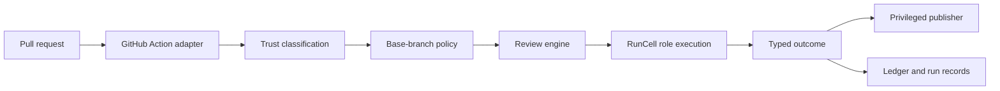

Diffowl keeps canonical review semantics independent from GitHub effects and provider execution details.

## Review engine

The engine owns:

- project-policy interpretation;
- trust-constrained orchestration plans;
- candidate and finding normalization;
- verification state;
- finding-ledger transitions;
- versioned run records;
- typed review outcomes.

It returns data and never publishes directly to GitHub.

## RunCell orchestration

RunCell executes reviewer, challenger, and verifier roles and provides structured outputs, files, events, and snapshots. Diffowl treats it as an implementation layer, not as the product's trust or security boundary.

## GitHub Action adapter

The adapter translates GitHub events and repository state into engine input. It loads base-branch policy, classifies trust before risky work, selects persistence, and passes normalized output to publication.

## Privileged publisher

The publisher is SHA-bound and data-only. It validates schema, size, source run, target repository, and exact head revision before producing GitHub effects. It cannot execute pull-request code.

## Local CLI adapter

The CLI uses the same engine but local inputs, credentials, filesystem persistence, and reporting. Its trust class explicitly prevents local work from being represented as CI-trusted publication.

## Persistence

Persistence interfaces cover finding ledgers, run records, execution snapshots, and publication receipts. V1 supports:

- dedicated Git refs for GitHub-hosted trusted runs;
- a permission-restricted filesystem directory for explicit self-hosted and local operation.

No hosted database is required.

## Evaluation

`evaluateSyntheticCorpus` produces repeatable report cards from material-finding cases and clean controls. `createV1ReleaseReportCard` and `evaluateV1ReleaseGate` combine corpus observations with required threat-test and installation evidence.

The canonical implementation specification remains in [`docs/specs/diffowl-v1.md`](https://github.com/D4NZ-jpg/diffowl/blob/main/docs/specs/diffowl-v1.md), with architecture decisions under [`docs/adr`](https://github.com/D4NZ-jpg/diffowl/tree/main/docs/adr).
